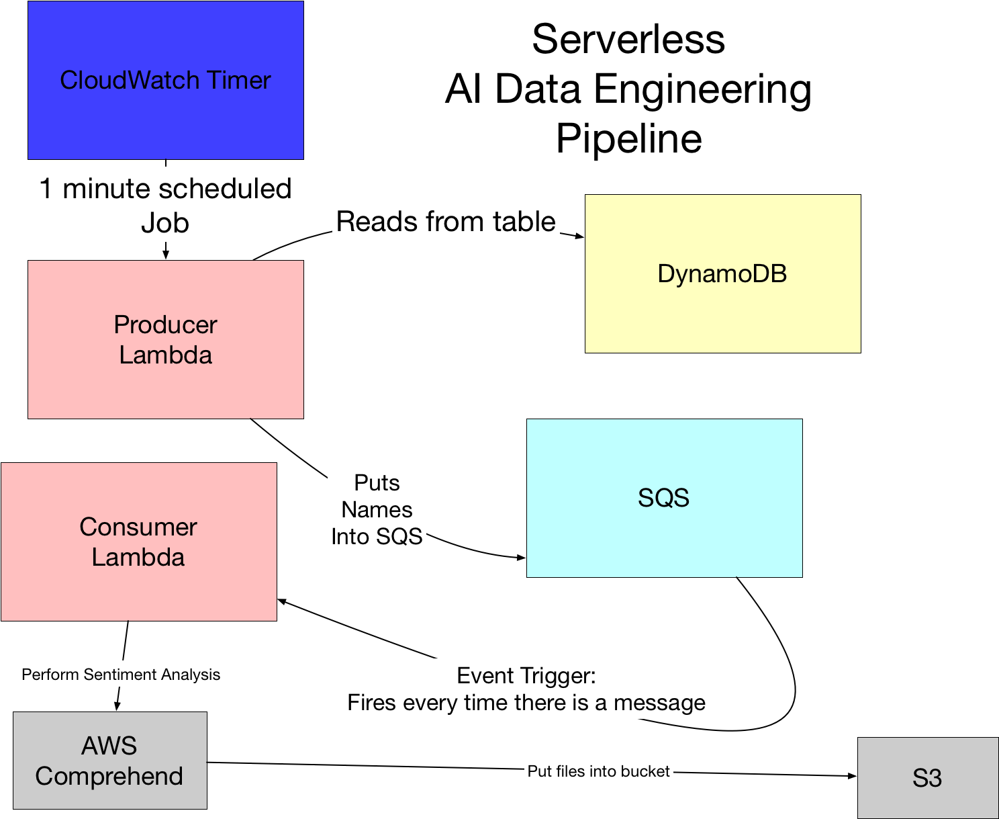
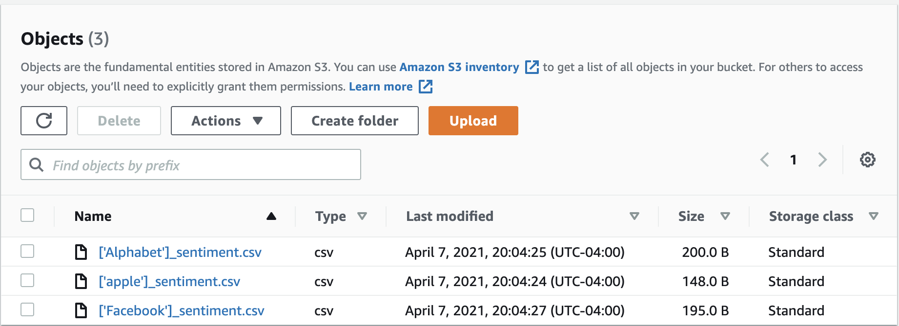

# AWS Data Engineering Pipeline 
This is a repository for the Duke University Cloud Computing course project on Serverless Data Engineering Pipeline. For this project, I recreated the below pipeline in iCloud9 (reference: https://github.com/noahgift/awslambda): 




Below are the steps of how to build this pipeline in AWS: 

1️⃣ Create a new iCloud9 environment dedicated to this project. 

🤔 Need a refresher? Please check this [repo](https://github.com/noahgift/awslambda/blob/master/beginners_guide_aws_lambda.ipynb). 

⚠️ Make sure to use `name` as your unique id for your items in the `fang` table. 

2️⃣ Create  a `fang` table in DynamoDB and SQS queue. 

You can check how to do it [here](https://www.youtube.com/watch?v=zXxdbtamoa4). 

3️⃣ Build *producer* Lambda Function 

1. In iCloud9, initialize a serverless application with [SAM template](https://docs.aws.amazon.com/serverless-application-model/latest/developerguide/sam-cli-command-reference-sam-init.html): 

   ```python
   sam init 
   ```

*Inputs:* 1, 2, 4, "producer"

2. Set virtual environment and source it: 

   ```python
   # I called my virtual environment "comprehendProducer"
   python3 -m venv ~/.comprehendProducer
   source ~/.comprehendProducer/bin/activate
   ```

3. Add the code for your application to  `app.py`

4. Add relevant packages used in your app to `requirements.txt` file 

5. Install requirements 

   ```python
    cd hello_world/
    pip install -r requirements.txt 
    cd .. 
   ```

6. Create a repository (`producer`) in Elastic Container Registry (ECR) and copy its URI 

7. Build and deploy your serverless application: 

   ```python
   sam build 
   sam deploy --guided
   ```

   When prompted to input URI, paste the URI for the `producer` repository that you've just created. 

8. Create IAM Role granting Administrator Access to the Producer Lambda function. 

   🤔 Not sure how to create IAM Role? Check out this [video](https://www.youtube.com/watch?v=zXxdbtamoa4) (17 min ).

9. Add the execution role that you created to the Producer Lambda function. 

   In case you forgot how to do it:  

   In AWS console: Lambda ➡️ click on producer function ➡️ configuration ➡️ permissions ➡️ Edit ➡️ Select the role under `Existing role`.

10. You are all set with the `producer` function! Now deactivate virtual environment: 

    ```
    deactivate 
    cd .. 
    ```

4️⃣ Create an S3 bucket and note its name

5️⃣ Build *consumer* Lambda Function 

Repeat steps in 3️⃣. 

⚠️ In #3 when you add the code for a consumer app to `app.py`, make sure to replace `bucket="fangsentiment"` with the name of your S3 bucket. 

6️⃣ Add triggers to Lambda Functions 

🤔 Not sure how to do it? Check out this [video](https://www.youtube.com/watch?v=zXxdbtamoa4) (start times are noted below): 

Producer Lambda Function: *CloudWatchEvent*(30 min)

Consumer Lambda Function: *SQS* (42 min)

7️⃣ If all goes well, you will see sentiment results in your S3 bucket: 




💡Tip: If you've already deployed your Lambda function but need to edit your application, you can make the necessary edits to your app and build and deploy the app again: 

```
sam build && sam deploy 
```

💡Tip: If you don't have space left on disk, you may want to remove a few docker containers that you don't use. 

```python
#list containers 
docker image ls 
# remove a container 
docker image rm <containerId>
```

